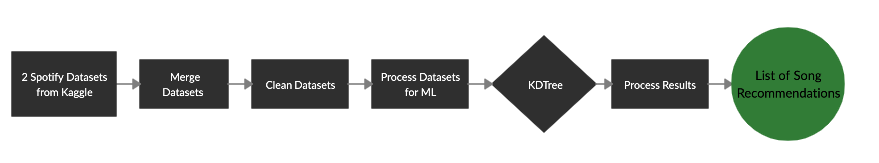
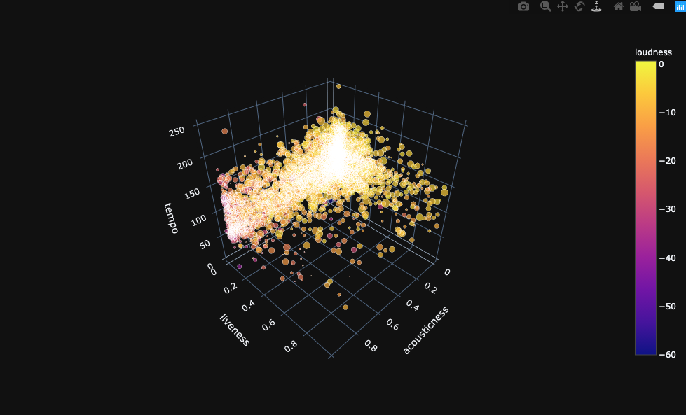

# Data Science - Spotifier
This is the Data Science portion for an Application that uses Machine Learning to build a Song Recommender based on a User's song selection and music preference.

You can visit the application here: [Spotifier.com]()

## Flowchart


## Project Info
For the Data Science portion of this application, we used this Kaggle [Spotify Audio Features](https://www.kaggle.com/tomigelo/spotify-audio-features) Dataset. Within it you will find a number of tracks and for every track an artist. You will also find Spotify's Track Id, along with a number of numeric audio features such as acousticness, danceability, tempo, speechiness and several more. We took this information and utilized a [KDTree](https://scikit-learn.org/stable/modules/generated/sklearn.neighbors.KDTree.html) from Scikit Learn in order to model our Song Recommender. This method finds the songs nearest to each other in terms of the numerical audio features previously mentioned. From there we have a list of songs, and along with each song is a number of recommended songs(in the example we use 15). We then pass this list into a CSV file and then to an S3 Database via AWS. From there it is passed on to our Backend Team to process it and get it ready for our Front End developers. 

## API Endpoint 

`POST`

API Endpoint:  https://spotifier-recommender-api.herokuapp.com/api

Do a POST request with:

```
{"Searched_Song":"2RM4jf1Xa9zPgMGRDiht8O"}
```

Where `"Searched_Song"` is the `Track Id`, and returns `Track Ids` of 10 similar songs.

Returns

```
{
  "Nearest_Song1": "27j0DacqVJQh0zfeT3ro04",
  "Nearest_Song10": "5W0TmFbf99HsjItflpvu2y",
  "Nearest_Song2": "0v2ho4OPJppOu3JXtuiNWG",
  "Nearest_Song3": "1wDVA4RdRktGUj1PO9UWry",
  "Nearest_Song4": "1JueotTuCnkcTA7tBA5hLR",
  "Nearest_Song5": "6gL8GtFF83CljrwbTOWTYa",
  "Nearest_Song6": "0xOMrILs6M1Xf9uoihYRy7",
  "Nearest_Song7": "68CcjsUbRVus2F1MlcvHTx",
  "Nearest_Song8": "0i9ctiWzDtHBuL19lVXv8t",
  "Nearest_Song9": "2OIZgCdPVPHAV8ZJAkEmAI",
  "Searched_Song": "2RM4jf1Xa9zPgMGRDiht8O",
  "index": 0
}
```
## Visual Representationss of What Our ML Model is doing



## Logs

- 2019-09-21 - Started explanatory notebooks
- 2019-09-23 - Re-structured and organized folders, and files

## Contributing
Pull requests are welcome. However for major changes, please open an issue first to discuss what you would like to change.

Please make sure to update tests as appropriate.

## License
[MIT](https://choosealicense.com/licenses/mit/)
